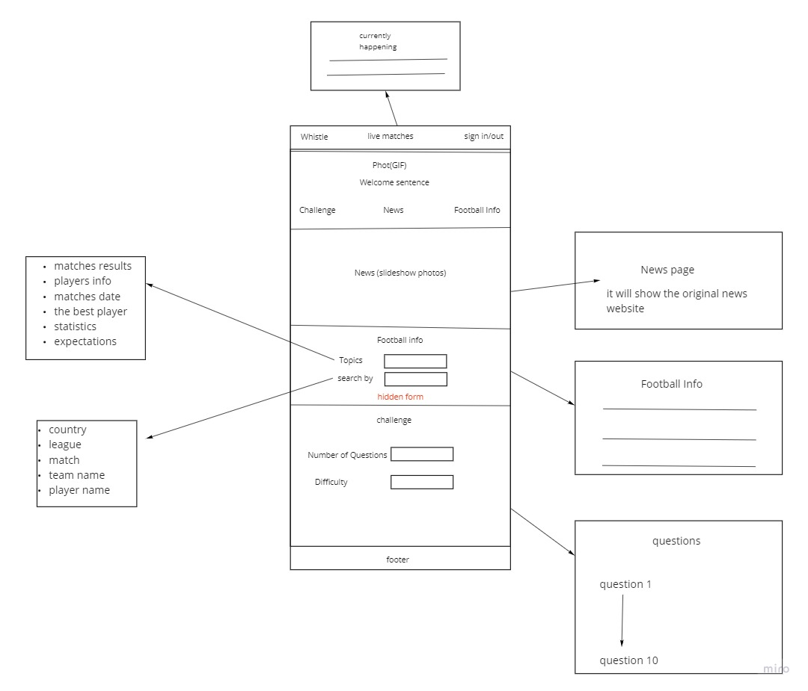

# whistle
Whistle project is a website that contains the news of the football, information about football players and a challenge to test your knowledge about sport.

TopDots is the team who is working on this project, and its members are:
- Aya Akrabawi
- Hamza Sami
- Saifdeen Alrawad
- Malek Hassan 

And the work will be planned within trello board:
https://trello.com/b/dpKs1yGN/whistle

here is the wireframe of the website:

